RDP Brute Force Attack Detection using Splunk (SOC Simulation Lab)
Overview
This project simulates a brute-force attack on a Windows machine using RDP from a Kali Linux attacker system and demonstrates how to detect this activity using Splunk.

The lab follows a real SOC workflow:
Recon → Attack → Log Generation → SIEM Ingestion → Detection

------------------------------------------------------------

Objectives
- Identify open RDP service on target system
- Simulate brute-force login attempts
- Generate Windows Security logs (Event ID 4625 & 4624)
- Detect attacker activity using Splunk queries
- Correlate attacker IP with login attempts

------------------------------------------------------------

Lab Setup
Attacker: Kali Linux (192.168.20.11)
Target: Windows 10 (192.168.20.10)
SIEM: Splunk Enterprise
Protocol: RDP (Port 3389)

------------------------------------------------------------

Step 1: Enable RDP on Target Machine
RDP was enabled on the Windows machine to allow remote connections.

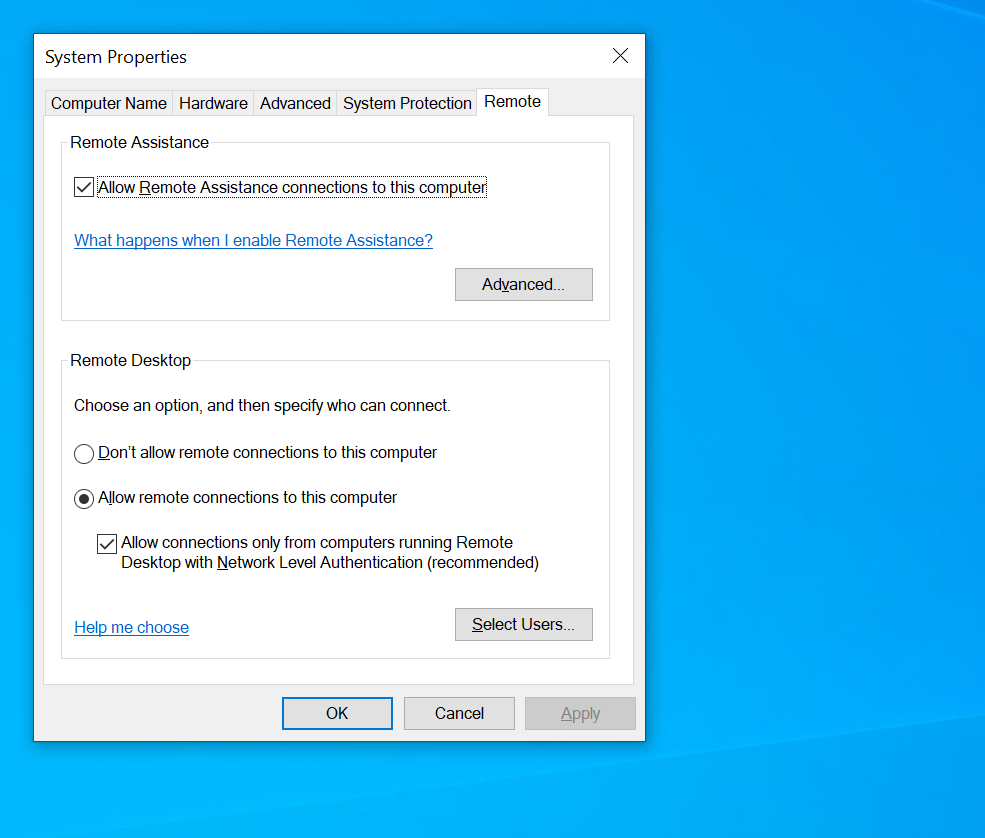

------------------------------------------------------------

Step 2: Verify RDP Port (3389)

Command used:
netstat -an | find "3389"

Result:
Port 3389 is LISTENING

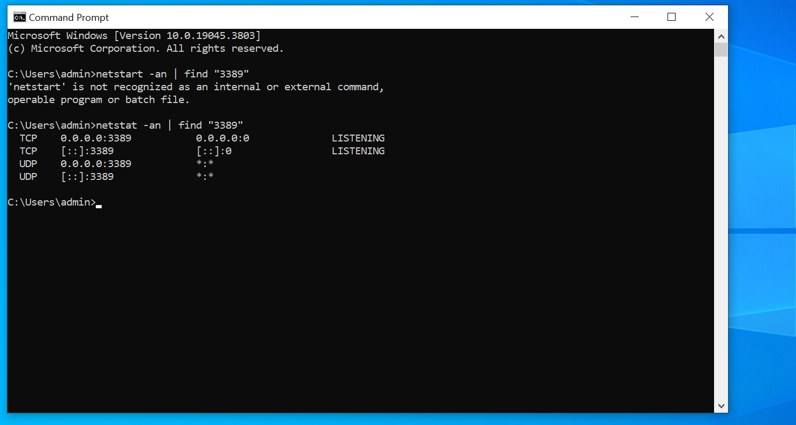

------------------------------------------------------------

Step 3: Reconnaissance using Nmap

Command used:
nmap -Pn -p 3389 192.168.20.10

Result:
Port 3389 is OPEN
Service: ms-wbt-server (RDP)

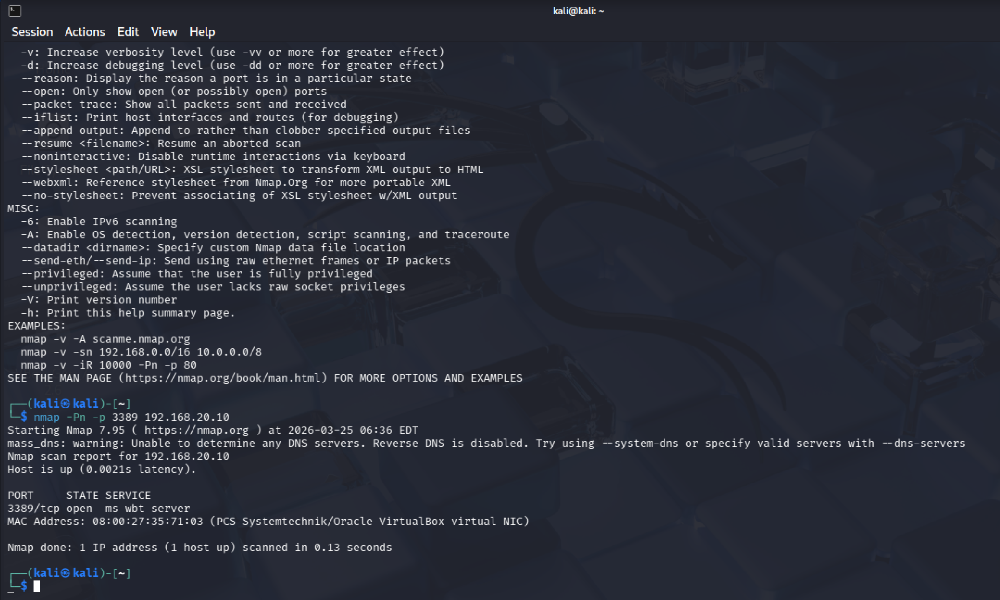

------------------------------------------------------------

Step 4: Brute Force Attempt (Initial Failures)

Command used:
xfreerdp /u:admin /p:<wrong_password> /v:192.168.20.10

Result:
Authentication failure
Multiple failed login attempts generated

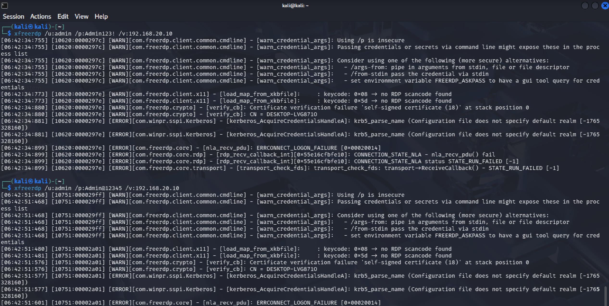

------------------------------------------------------------

Step 5: Successful RDP Login

Command used:
xfreerdp /u:admin /p:<correct_password> /v:192.168.20.10

Result:
Successful login
Access to target system

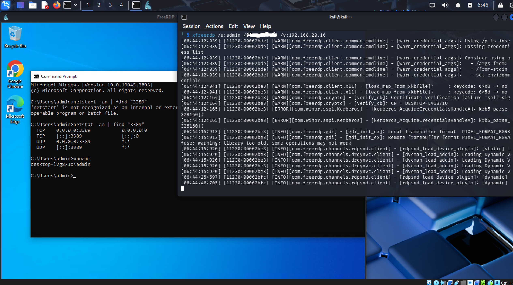

------------------------------------------------------------

Step 6: Post-Login Command Execution

Command executed:
whoami

Result:
desktop-lvg8710\admin

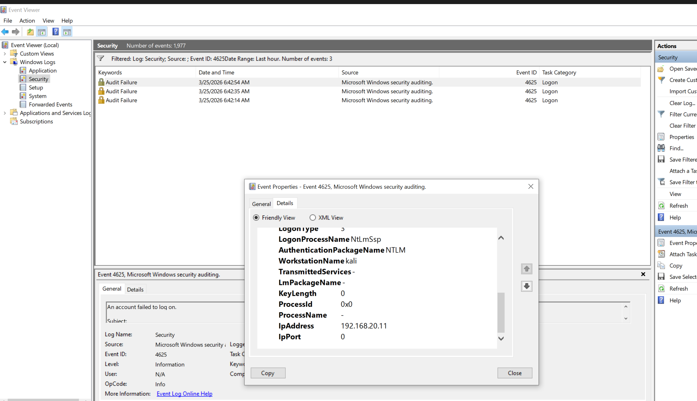

------------------------------------------------------------

Step 7: Failed Login Logs (Event ID 4625)

Observation:
Multiple failed login attempts detected
Source IP: 192.168.20.11
Failure reason: Unknown user name or bad password

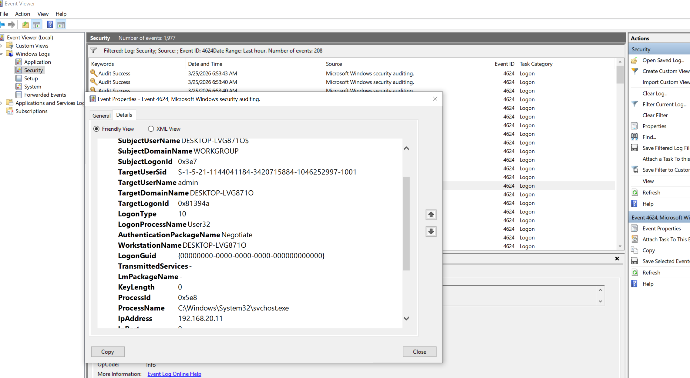

------------------------------------------------------------

Step 8: Successful Login Logs (Event ID 4624)

Observation:
Logon Type: 10 (RDP)
Source IP: 192.168.20.11

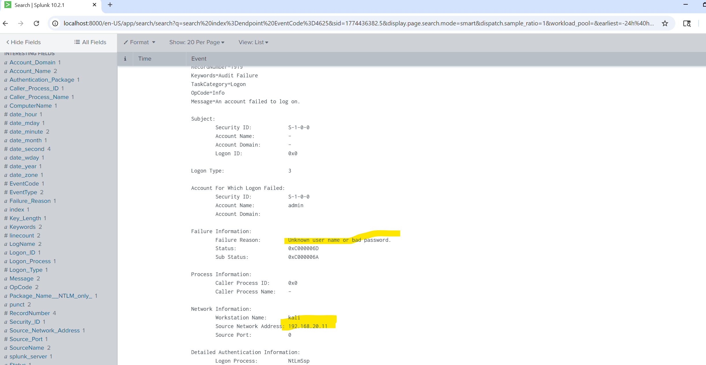

------------------------------------------------------------

Step 9: Splunk – Failed Login Detection

Query used:
index=endpoint EventCode=4625

Result:
Multiple failed login attempts from same IP

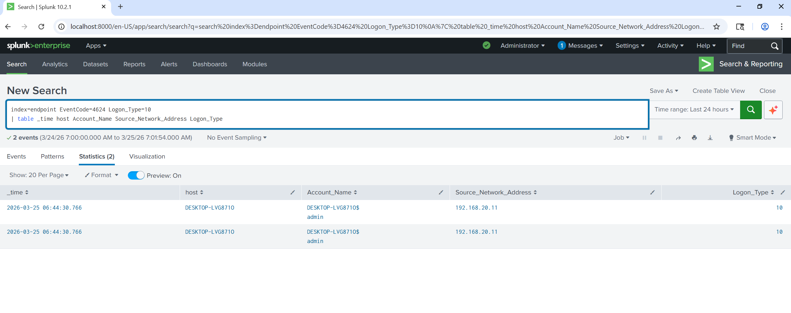

------------------------------------------------------------

Step 10: Splunk – Successful Login Detection

Query used:
index=endpoint EventCode=4624 Logon_Type=10

Result:
Successful RDP login detected

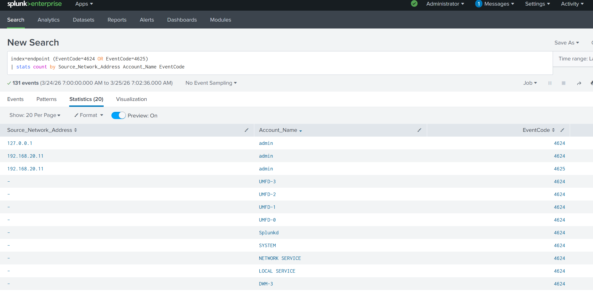

------------------------------------------------------------

Step 11: Aggregated Analysis

Query used:
index=endpoint (EventCode=4624 OR EventCode=4625)
| stats count by Source_Network_Address Account_Name EventCode

Result:
Clear brute-force pattern observed

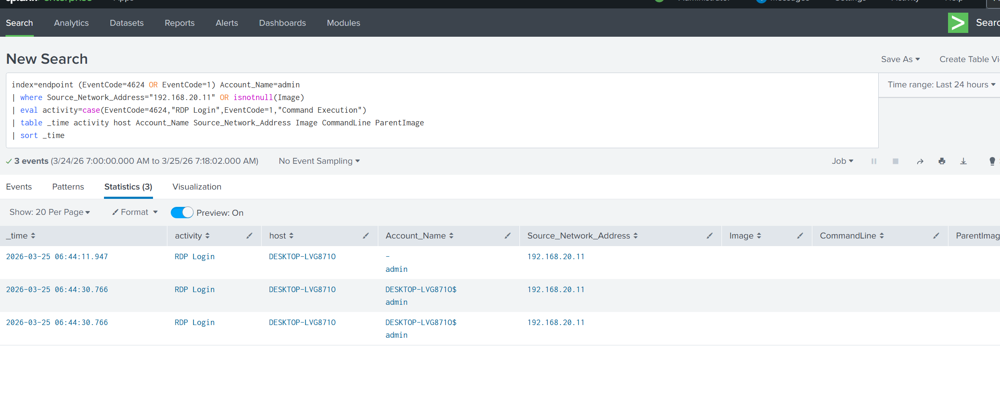

------------------------------------------------------------

Step 12: Advanced Correlation (SOC Level)

Query used:
index=endpoint (EventCode=4624 OR EventCode=1) Account_Name=admin
| where Source_Network_Address="192.168.20.11"
| eval activity=case(EventCode=4624,"RDP Login",EventCode=1,"Command Execution")
| table _time activity host Account_Name Source_Network_Address Image CommandLine
| sort _time

Result:
Full attack timeline:
Login → Command execution

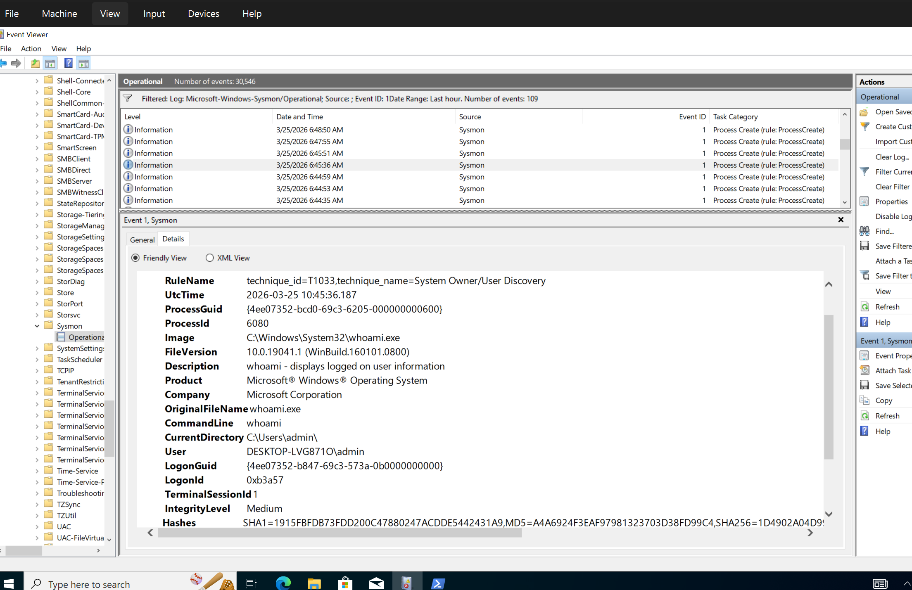

------------------------------------------------------------

Key Findings
Attacker IP: 192.168.20.11
Target Account: admin
Attack Type: RDP Brute Force

Evidence:
- Multiple failed login attempts (Event ID 4625)
- Successful login (Event ID 4624)
- Command execution (Sysmon Event ID 1)

------------------------------------------------------------

Detection Strategy
- Monitor repeated failed logins from same IP
- Detect multiple failures followed by success
- Correlate login activity with process execution

------------------------------------------------------------

Challenges Faced
- Understanding log correlation
- Mapping attack behavior to events
- Writing effective Splunk queries

------------------------------------------------------------

Conclusion
This lab demonstrates how brute-force attacks can be simulated and detected using Splunk. By correlating failed and successful login attempts with process execution, attacker activity can be clearly identified.

------------------------------------------------------------
